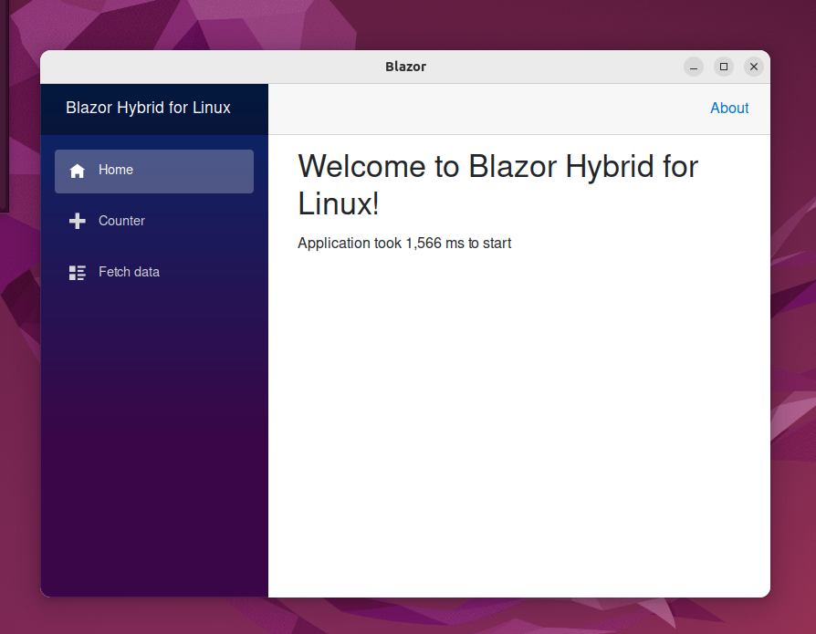

# BlazorWebView
A [WebKitGTK](https://webkitgtk.org/) WebView, utilizing [Gir.Core](https://gircore.github.io/), for running [Blazor Hybrid](https://learn.microsoft.com/en-us/aspnet/core/blazor/hybrid/) applications on Linux without the need to compile a native library.  It is analagous to the [Winforms BlazorWebView](https://learn.microsoft.com/en-us/dotnet/api/microsoft.aspnetcore.components.webview.windowsforms.blazorwebview) or the [WPF BlazorWebView](https://learn.microsoft.com/en-us/dotnet/api/microsoft.aspnetcore.components.webview.wpf), but for Linux instead of Windows.

Blazor Hybrid apps allow one to create Blazor desktop applications that uses the local machine's .NET runtime (not Blazor WASM), has full access to local resources (not sandboxed), and does not require hosting through a web server (e.g. Blazor server). It is just like any other desktop application written in C#, but uses Blazor and web technologies to implement the user interface.

## Why?
Microsoft has decided to not support Maui on Linux, so there is currently no way to create Blazor Hybrid apps on Linux using *only* C#.

## How?
BlazorWebView uses some of the same code as [Steve Sanderson's WebWindow](https://github.com/SteveSandersonMS/WebWindow) and leverages [Microsoft's WebView infrastructure](https://github.com/dotnet/aspnetcore/tree/main/src/Components/WebView) to get Blazor Hybrid working.  However, it differs from WebWindow in that it doesn't require one to compile a native shared library in C++, instead utilizing [Gir.Core](https://gircore.github.io/) to call into the native libraries.   This has the benefit that, as long as the native libraries are installed on the Linux system, one only needs to use the `dotnet` CLI to build and run BlazorWebView.

## Screenshot


## Demonstration

### Using a Linux terminal
```
git clone https://github.com/JinShil/BlazorWebView.git
cd BlazorWebView/WebKitGtk.Test
dotnet run
```

### Using Visual Studio Code
On a Linux computer, simply open this repository in Visual Studio Code and press F5 to start a debug session.

### Ubuntu 24.04 bwrap error fix
Running the demo project may fail with the following error on ubuntu 24.04:

    bwrap: setting up uid map: Permission denied

This is due to the Ubuntu developers' decision to use AppArmor to restrict the creation of user namespaces. Below are the steps for applying a new AppArmor profile to enable user namespace restriction:

```sh
# Download the new profile:

sudo wget -O /etc/apparmor.d/bwrap-userns-restrict "https://gitlab.com/apparmor/apparmor/-/raw/master/profiles/apparmor/profiles/extras/bwrap-userns-restrict?ref_type=heads&inline=false"

# Load the new profile into AppArmor:
sudo apparmor_parser -r /etc/apparmor.d/bwrap-userns-restrict

# Restart the AppArmor service:
sudo systemctl restart apparmor
```

## Usage
See the project in [WebKitGtk.Test](https://github.com/JinShil/BlazorWebView/tree/main/WebKitGtk.Test) for an example illustrating how to create a Blazor Hybrid application using the BlazorWebView.

You may need to install the following packages:
* libadwaita-1-0
* libwebkitgtk-6.0-4

## Status
This project was tested on:
- Windows Subsystem for Linux. Detailed setup instructions are available [here](./WSL2.md).
- Raspberry Pi Bullseye 64-bit
- Debian Bullseye 64-bit.
- Ubuntu 24.04 LTS desktop amd64

The root .vscode directory has the necessary configuration files to build, deploy, and debug a Raspberry Pi from a Debian Bullseyse 64-bit workstation PC.
